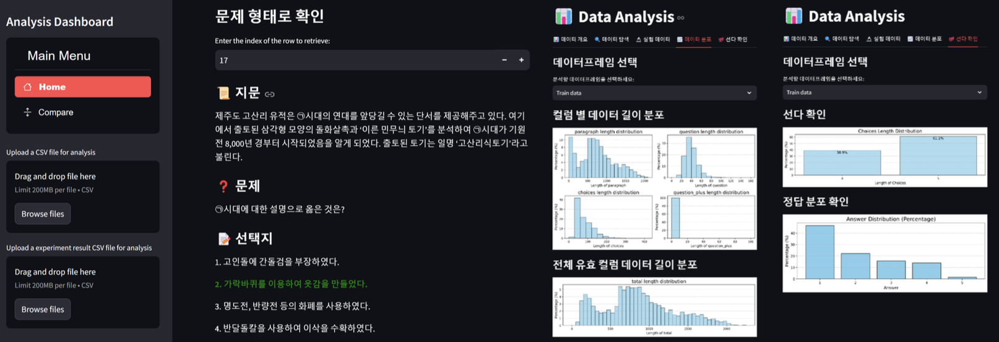

# 수능 문제 풀이 모델


한국어의 특성과 수능 시험의 특징을 바탕으로 **수능에 최적화된 모델**을 만듭니다.

## 📌 프로젝트 개요

- **목표**: 수능 문제 풀이를 위한 최적화된 언어 모델 연구 및 개발
- **주요 내용**:
  - 다양한 모델 및 하이퍼파라미터 성능 비교
  - 데이터 정제 및 증강을 통한 학습 효율 향상
  - CoT(Chain of Thought) 방식 적용에 따른 추론 능력 평가
  - RAG(Retrieval-Augmented Generation) 활용으로 검색 기반 답변 성능 실험

## 최종 결과

`4bit` 양자화를 적용한 `Qwen2.5-32B-Instruct` 모델을 활용하여 **0.7747의 정확도를 달성**했습니다.

| 모델                                | 조건                                    | Accuracy   |
| ----------------------------------- | --------------------------------------- | ---------- |
| finetuned gemma-2b-ko (base)        | 기본 설정                               | 0.3862     |
| finetuned gemma-2b-ko               | 데이터 정제 및 증강                     | 0.4138     |
| finetuned Qwen-2.5-32b-Instruct     | 기본 설정                               | 0.7540     |
| finetuned Qwen-2.5-32b-Instruct     | 데이터 정제 및 증강                     | 0.7632     |
| **finetuned Qwen-2.5-32b-Instruct** | **데이터 정제 및 증강 + Prompt Tuning** | **0.7747** |

위 표는 수능형 문제 풀이 성능을 모델과 실험 조건에 따라 비교한 결과입니다.

베이스 모델인 `gemma-2b-ko`에서 데이터 정제 및 증강으로 소폭 성능 향상을 확인하였으며, 이는 최종 선정된 모델인 `Qwen-2.5-32b-Instruct`에서도 확인 할수 있었습니다. 최종적으로 데이터 증강 및 Prompt Tuning을 추가한 **Qwen-2.5-32b-Instruct** 모델이 **0.7747**로 가장 높은 정확도를 달성했습니다.

## 다양한 모델 및 하이퍼파라미터 성능 비교


## 데이터 정제 및 증강


## CoT 적용에 따른 추론 능력 평가

## RAG를 활용한 검색 기반 답변 성능 실험

## Streamlit



## Project Quick Setup

### Requirements

- Python: 3.10
- CUDA: >= 12.1
- PyTorch: 2.5.1+cu121

### Git Clone

```shell
$ git clone git@github.com:boostcampaitech7/level2-nlp-generationfornlp-nlp-06-lv3.git
$ cd level2-nlp-generationfornlp-nlp-06-lv3
```

### Import Data

`data/` 디렉토리안에 `train/valid/test` 데이터를 위치시킵니다.

### Create Virtual Environment

```shell
$ python -m venv .venv
$ source .venv/bin/activate
(.venv) $
```

### Install Packages

```shell
(.venv) $ pip install -r requirements.txt
```

### Setup Envronment Variables

`.env`를 생성 후 환경 변수를 수정합니다.

```shell
(.venv) $ cp .env.example .env
```

- `HF_TOKEN`: `HuggingFace`로 부터 모델을 내려받기 위해 필요한 토큰
- `STREAMLIT_DATA_PATH`: streamlit 구동 시 필요한 기본 설정 데이터 경로
- `STREAMLIT_EXPERIMENT_DATA_PATH`: streamlit 구동 시 필요한 실험 데이터 경로
- `PINECONE_API_KEY`: RAG vector db pinecone api key
- `PINECONE_INDEX`: RAG vector db pinecone index
- `PINECONE_ENVIRONMENT`: RAG vector db pinecone Environment
- `OPENAI_API_KEY`: 데이터 증강용 api key

```shell
HF_TOKEN={your_hf_token}
STREAMLIT_DATA_PATH={streamlit_data_path}
STREAMLIT_EXPERIMENT_DATA_PATH={streamlit_experiment_data_path}

# API Key for Pinecone service
PINECONE_API_KEY={your_api_key}
# Index name used in Pinecone
PINECONE_INDEX={your_index_name}
# Environment for Pinecone (e.g., 'us-west1-gcp')
PINECONE_ENVIRONMENT={your_environment}

OPENAI_API_KEY={your_openai_api_key}
```

## Config.yaml

`config.yaml` 파일을 사용하여 원하는 환경에서 실행을 설정할 수 있습니다. 아래는 기본 설정 예시입니다:

```yaml
model:
  name_or_path: "beomi/gemma-ko-2b"
  response_template: "<start_of_turn>model\n"
  without_system_role: false # Deprecated (항상 system 없이 동작)
  torch_dtype: "float16" # float32, float16, bfloat16 / 모델의 기본 데이터 타입

common:
  seed: 42
  device: "cuda"
  cot_on: false # cot 사용 시 prompt_template을 cot_json으로 변경 필요
  prompt_template: "base" # base, cot_json

bnb:
  load_in_8bit: false
  load_in_4bit: false
  bnb_4bit_compute_dtype: "float16" # float16, float32, bfloat16 / 4 bit 양자화 데이터의 계산 데이터 타입
  bnb_4bit_use_double_quant: false # true 시 더블 양자화(메모리 사용량 감소, 시간 더 걸림)
  bnb_4bit_quant_type: "nf4" # nf4, fp4

earlystop:
  metric_for_best_model: "eval_loss" # 모니터링할 지표 이름
  early_stopping_patience: 1 # 개선되지 않는 에폭 수
  early_stopping_threshold: 0.0 # 개선으로 간주할 최소 변화량
  greater_is_better: false # 지표가 높을수록 좋은 경우 True

peft:
  r: 6
  lora_alpha: 8
  lora_dropout: 0.05
  target_modules: ["q_proj", "k_proj"]
  bias: "none"
  task_type: "CAUSAL_LM"

sft:
  do_train: true
  do_eval: true
  lr_scheduler_type: "cosine"
  max_seq_length: 1024
  per_device_train_batch_size: 1
  per_device_eval_batch_size: 1
  num_train_epochs: 3
  learning_rate: 2.0e-5 # 지수 자릿수 앞부분을 실수 형태로 작성 ('2'-> x, '2.0'-> o)
  weight_decay: 0.01
  logging_strategy: "steps" # epoch or steps, epoch의 경우 logging_steps 무시
  logging_steps: 100
  save_strategy: "epoch"
  eval_strategy: "epoch"
  load_best_model_at_end: true
  save_total_limit: 1
  save_only_model: true
  report_to: "wandb" # none or wandb, wandb로 변경하여 로그를 기록합니다.

wandb:
  project: "MMLU"

train:
  data_path: "data/train_v2.0.1.csv" # wandb 로깅 사용시 파일명 변겅 금지(데이터 버전 정보 사용)
  valid_data_path: "data/valid_v2.0.1.csv"
  valid_output_path: "data/valid_output.csv"

inference:
  model_path: "outputs/gemma-ko-2b" # 학습된 모델로 변경 필요
  data_path: "data/test_v1.0.2.csv"
  output_path: "data/output.csv"
  raw_output_path: "data/raw_output.csv"
  default_answer: 1
```

### Custom Config

기본 설정 외에 사용자 정의 설정을 사용하려면 `configs/config.yaml` 파일을 복사한 뒤 수정하세요:

```shell
(.venv) $ cp configs/config.yaml configs/config_custom.yaml
(.venv) $ vi configs/config_custom.yaml
```

## Train 및 Inference 실행

### Train

학습을 실행하려면 기본 `train.py` 파일을 실행합니다:

```shell
(.venv) $ python train.py
```

커스텀 설정을 적용하려면 -c 또는 --config 옵션을 사용하세요:

```shell
(.venv) $ python train.py -c config_custom.yaml
```

- -c 옵션에는 configs 디렉토리 내부의 YAML 파일 이름만 입력합니다.

### Inference

학습된 모델을 사용하여 추론을 진행합니다:

```shell
(.venv) $ python inference.py
```

커스텀 설정을 사용하려면 다음 명령어를 실행하세요:

```
(.venv) $ python inference.py -c config_custom.yaml
```

`valid` 데이터에 대한 추론을 진행하려면 `-v` 옵션을 추가합니다:

> `valid`에 대한 모델의 성능을 확인할 수 있습니다

```shell
(.venv) $ python inference.py -v

# or

(.venv) $ python inference.py -c config_custom.yaml -v
```

## Contribution Guide

프로젝트에 기여하는 방법에 대한 가이드입니다. 아래 내용을 참고하여 작업 시 일관성을 유지해주세요.

### 커밋 템플릿 사용법

프로젝트에서 커밋 메시지 형식을 통일하기 위해 커밋 템플릿을 설정할 수 있습니다. 아래 명령어를 실행하여 템플릿을 적용하세요:

```
$ git config commit.template .gitcommit_template
```

- `.gitcommit_template` 파일은 프로젝트 루트에 있는 커밋 템플릿 파일입니다.
- 위 명령어를 실행하면 커밋 시 템플릿이 자동으로 불러와집니다.

## Collaborators

|          [강감찬](https://github.com/gsgh3016)          |          [단이열](https://github.com/eyeol)          |          [안혜준](https://github.com/jagaldol)          |          [유선우](https://github.com/Usunwoo)          |          [유채은](https://github.com/canolayoo78)          |          [이채호](https://github.com/chell9999)          |
| :-----------------------------------------------------: | :--------------------------------------------------: | :-----------------------------------------------------: | :----------------------------------------------------: | :--------------------------------------------------------: | :------------------------------------------------------: |
|  |  |  |  |  |  |
